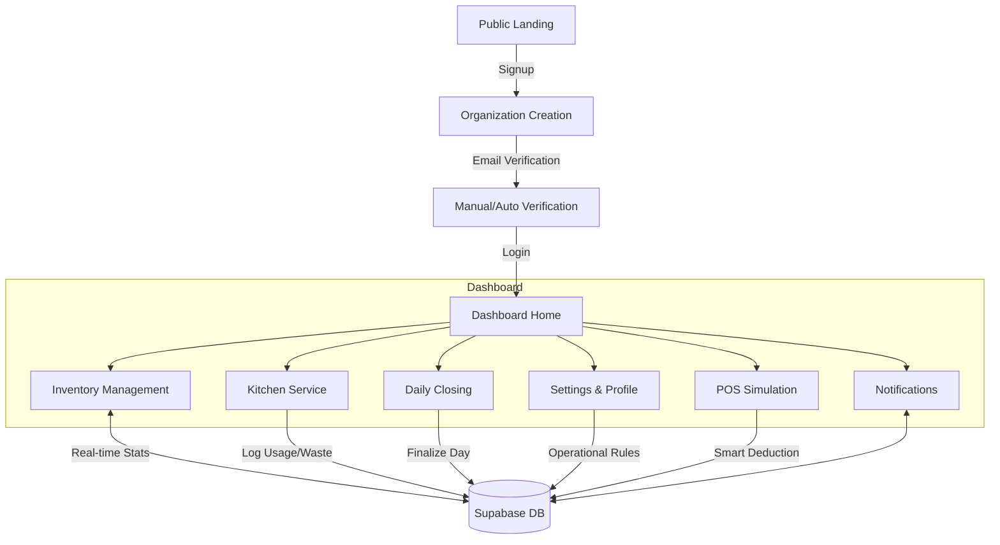

# System Overview: Dosteon Dashboard

This document provides a comprehensive status report and architectural flow of the Dosteon Restaurant Management System.

## 1. System Architecture & Flow

The system follows a modern decoupled architecture using **Next.js (Frontend)** and **FastAPI (Backend)**, communicating via RESTful APIs and utilizing **Supabase** for Auth and PostgreSQL (RLS enabled).

---

## 2. Module Status & Roadmap

### A. Authentication, Login & Logout

- **Status**: ✅ **COMPLETE**
- **Frontend**: Professional Signup, Login, and Email Confirmation screens. Logout handled via Supabase session termination.
- **Backend**: `AuthService` manages user lifecycle, organization link, and profile creation. `EmailService` handles verification via SMTP.
- **Manual Bypass**: `smart_repair.py` exists to bypass email limits for development/emergency.

### B. Time & Global Synchronization

- **Status**: ✅ **COMPLETE**
- **Implementation**: `DashboardHeader` contains a real-time reactive clock. Date and breadcrumbs are dynamically generated based on the server/system time.
- **Contextual Time**: Dashboard greetings and "Closing Stock" unlock times are calculated based on live operational hours.

### C. Smart/Automatic Updates (POS Integration)

- **Status**: ✅ **COMPLETE**
- **Implementation**: A full **Recipe Framework** is now live. Each Menu Item is linked to specific inventory ingredients. When an order is placed in the **POS Simulation**, the system automatically calculates and deducts the precise quantities from the live inventory.
- **Features**:
  - **Recipe Mapping**: Define multiple ingredients per menu item (e.g., 250ml Milk + 18g Coffee for a Latte).
  - **POS Simulation**: Dedicated screen to place orders and see real-time inventory impact.
  - **Activity Logging**: Each smart deduction is logged and reflected in dashboard stats.

### D. Dashboard Home

- **Status**: ✅ **INTEGRATED**
- **Implementation**: Displays real-time stats from the backend. "Recent Activities" show live audit logs of system events, including smart POS deductions.
- **Needed**: Financial charts (Revenue/Cost) once the finance module is integrated.

### E. Inventory Module

- **Status**: ✅ **INTEGRATED**
- **Implementation**: Fully connected to `inventory_items` table. Supports category filtering and "Running Low" highlights that update automatically as POS orders are placed.
- **Needed**: Supabase Storage integration for uploading actual product images.

### F. Kitchen Service

- **Status**: ✅ **INTEGRATED**
- **Implementation**: Real-time logging of Usage and Waste. Features a direct link to the POS Simulation for end-to-end testing.
- **Needed**: "Shift End" summary report for kitchen staff.

### G. Daily Closing

- **Status**: ⚡ **PENDING FULL FLOW**
- **Status**: UI exists and is locked until closing time. Prerequisites logic is in place.
- **Needed**: Final "Review & Close" API that generates the daily performance summary and locks the day.

### H. Notifications

- **Status**: ✅ **INTEGRATED**
- **Status**: Live alert system for stock levels and system events. Filtering by "Unread" and "Alerts" functional.
- **Needed**: Browser push notifications and email summaries for critical stock events.

### I. Settings & Profile

- **Status**: ✅ **INTEGRATED**
- **Status**: Full management of Business Profile, Contact Info, and Operating Hours (which control system locking).
- **Needed**: Team/Staff management (inviting new users with roles).

---

## 3. High-Level Completion Roadmap

| Task                 | Priority | Description                                                              |
| :------------------- | :------- | :----------------------------------------------------------------------- |
| **Closing Flow**     | High     | Complete the final reconciliation API for end-of-day.                    |
| **Staff Roles**      | Medium   | Implement RBAC (Role Based Access Control) for Kitchen vs Manager paths. |
| **Supabase Storage** | Low      | Enable real image uploads for inventory items.                           |
| **Financial API**    | Low      | Integrate cost-per-unit into a total daily spend/loss report.            |

---

## 4. Required Action: SQL Schema

> [!IMPORTANT]
> To enable the **POS & Recipe** system, you MUST run the following SQL script in your Supabase SQL Editor:
> [backend/menu_and_recipes.sql](file:///c:/Users/jules/dashboard_v0.dev/backend/menu_and_recipes.sql)
