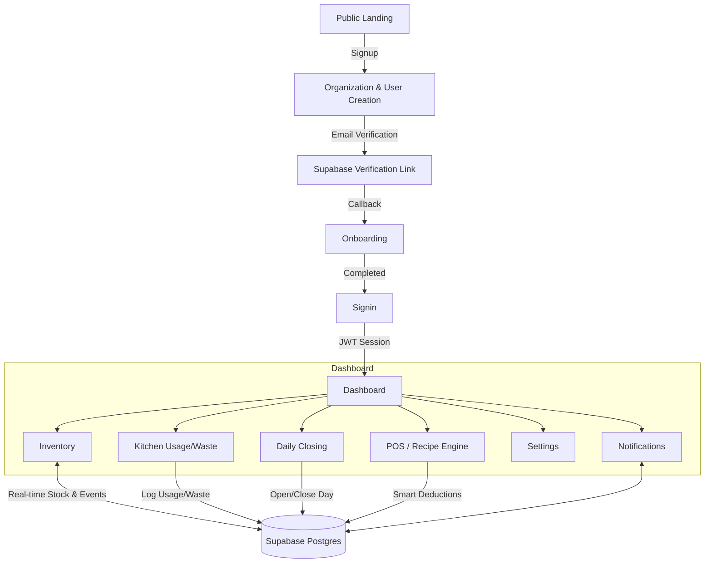

# Dosteon System Summary

This document gives a single high-level overview of the Dosteon platform, broken down by architecture, backend, frontend, auth flows, and operational domains.

---

## 1. High-Level Architecture

- **Frontend**: Next.js (App Router) TypeScript application, deployed on Vercel.
- **Backend**: FastAPI application with Prisma ORM, deployed on Render.
- **Data & Auth**: Supabase Postgres with Row-Level Security (RLS) and Supabase Auth for JWT/session management.
- **Communication**: Frontend talks to the backend via a single `/api` proxy that forwards to the FastAPI service.
- **Tenancy**: Organization-centric (each restaurant/supplier is an `Organization`), with users and data scoped by organization.

---

## 2. Backend Overview (FastAPI + Prisma)

**Location**: `backend/`

### 2.1 Project Structure

- `app/`
  - `api/` – Versioned routers (e.g. `api/v1/auth`) and dependency wiring.
  - `core/` – Settings, security, logging, rate limiting, CORS, and health checks.
  - `repositories/` – Data access layer on top of Prisma.
  - `services/` – Business logic (Auth, Inventory, Organizations, Day lifecycle, etc.).
  - `schemas/` – Pydantic models for request/response validation.
- `prisma/` – Prisma schema, migrations, and SQL utilities.
- `scripts/` – Operational scripts (DB checks, seeding, repairs).
- `tests/` – Unit, integration, and e2e tests.

### 2.2 Core Domain Models

The data model is frozen for production and built around an event-driven inventory pattern.

- **Organization**
  - Root tenant (restaurant or supplier).
  - Stores name, slug, timezone, and settings.
- **UserProfile**
  - Links users to organizations.
  - Holds email, role (OWNER, MANAGER, CHEF, STAFF, etc.), first/last name.
- **CanonicalProduct**
  - Global catalog of products (e.g. "Tomato", "Whole Milk").
  - Prevents duplicates and keeps standardized categories/units.
- **ContextualProduct**
  - Organization-specific view of a product.
  - Fields include SKU, `current_stock`, reorder / critical thresholds and other local configuration.
- **InventoryEvent**
  - Immutable audit log of every stock change.
  - Examples: RECEIVED, USED, WASTED, ADJUSTED.
  - Each event logs quantity delta, source, actor, and timestamps.
- **DayStatus**
  - Tracks daily operational state per organization: CLOSED → OPEN → CLOSING → CLOSED.
  - Controls when specific actions (like closing counts) are allowed.

**Golden Rule**: Stock is derived from events.

1. Every change inserts an `InventoryEvent`.
2. `ContextualProduct.current_stock` is maintained as a performance cache derived from those events.

### 2.3 Services & Responsibilities

- **AuthService**
  - Signup (creates organization + Supabase user + profile).
  - Login (validates credentials, returns tokens used to set Supabase session client‑side).
  - Forgot/Reset password via Supabase recovery flows.
  - Resend verification emails.
  - Onboarding operations (post‑verification workspace setup).
- **Organization / User Services**
  - Manage organization settings, contact info, and operating hours.
  - Update user profile data (`PATCH /auth/me`).
- **Inventory Services**
  - CRUD for contextual products.
  - Orchestrate opening stock, restocks, and low‑stock monitoring.
- **Inventory Event Service**
  - Single entry point for any stock movement.
  - Ensures correctness of `InventoryEvent` + `current_stock` updates.
- **Day Lifecycle Service**
  - Enforces opening and closing flows.
  - Locks down certain actions based on the current `DayStatus`.

### 2.4 API & Infrastructure

- **Health & Probes**
  - Root `GET /` returns service metadata.
  - `/health/live` and `/api/v1/health/ready` expose liveness/readiness including DB connectivity.
- **Middleware**
  - Structured request logging with correlation IDs.
  - Rate limiting on sensitive endpoints (e.g. auth) via `slowapi`.
  - CORS configured for allowed frontend origins.

---

## 3. Frontend Overview (Next.js)

**Location**: `frontend/`

### 3.1 Project Structure

- `app/`
  - App Router structure (`page.tsx`, `layout.tsx`).
  - Auth routes (`/auth/restaurant/*`, `/auth/supplier/*`, `/auth/callback`).
  - Dashboard and onboarding routes.
- `components/`
  - Dashboard UI (header, inventory cards, charts, modals, etc.).
  - Auth components such as forms and guards.
- `context/`
  - `AuthContext` – wraps login/signup/forgot/reset flows and Supabase auth events.
  - `UserContext` – fetches the current user profile from the backend using the Supabase session.
- `lib/`
  - Supabase client/server helpers.
  - Axios instance pointing to the backend `/api` proxy.
- `styles/`, `types/`, `hooks/` – UI styling, shared types, and hooks (e.g. logout).

### 3.2 Environment & API Proxy

- `BACKEND_URL` determines where `/api/*` is proxied:
  - Local dev: `BACKEND_URL=http://localhost:8000`.
  - Production: `BACKEND_URL` points to the Render URL (e.g. `https://dosteonapp.onrender.com`).
- Next.js rewrite:
  - Requests to `/api/:path*` are forwarded to `${BACKEND_URL}/api/:path*`.

### 3.3 Major Frontend Features

- **Role‑based Auth Flows**
  - Separate auth entry points for suppliers vs restaurants.
  - Dynamic routing and copy based on account type.
- **Dashboard**
  - Central hub surfacing inventory status, recent activity, and operational shortcuts.
- **Inventory UI**
  - Lists contextual products, with "Running Low" highlights and category filters.
- **Kitchen & Usage**
  - Forms for logging usage and waste which create `InventoryEvent` records.
- **Daily Closing UI**
  - Guides the user through closing steps and enforces timing rules.
- **Notifications UI**
  - Central feed for stock alerts and system messages.
- **Settings UI**
  - Business profile, contact info, and operating hours management.

---

## 4. Authentication & User Lifecycle

### 4.1 Sign Up

1. User starts from a restaurant/supplier signup screen.
2. Frontend submits signup form to the backend (`POST /api/v1/auth/signup`).
3. Backend:
   - Creates an `Organization`.
   - Creates a Supabase user via the admin API.
   - Creates a `UserProfile` linked to the organization.
   - Triggers a background task to send a verification email via Supabase + Resend.
4. User sees a "check your email" confirmation while the background email send completes.

### 4.2 Email Verification & Callback

1. User clicks the Supabase verification link.
2. Supabase redirects back to the frontend callback: `/auth/callback?code=...&type=...`.
3. In the callback route:
   - A Supabase **server** client exchanges the `code` for a session and sets cookies.
   - Based on `type`:
     - `recovery` → redirect to the restaurant/supplier reset‑password page.
     - Otherwise → redirect to `/onboarding`.

### 4.3 Onboarding

- `/onboarding` lets the user:
  - Name their workspace (restaurant name).
  - Optionally provide location details.
- On completion or skip:
  - Frontend calls `/api/v1/auth/onboard` to update organization metadata.
  - Then redirects to `/auth/restaurant/signin?verified=true` so the signin page can show a success state.

### 4.4 Login & Session

1. User enters credentials on the signin page.
2. Frontend calls `POST /api/v1/auth/login`.
3. Backend validates and returns access/refresh tokens.
4. Frontend:
   - Uses the Supabase **browser** client to call `supabase.auth.setSession({ access_token, refresh_token })`.
   - Navigates to `/dashboard`.
5. `UserContext` uses the Supabase session to:
   - Fetch `/api/v1/auth/me` and cache the user profile with React Query.

### 4.5 Forgot/Reset Password

- **Forgot Password**
  - Frontend posts email + (optional) account type to `POST /api/v1/auth/forgot-password`.
  - Backend uses Supabase recovery links and sends an email via Resend.
  - API is idempotent and always returns a generic success message.
- **Reset Password**
  - User clicks recovery link → Supabase redirects back to `/auth/callback?type=recovery&account_type=...`.
  - Callback route redirects to the right reset form.
  - Frontend uses the current Supabase session’s access token to call `POST /api/v1/auth/reset-password`.

### 4.6 Logout

- A dedicated logout hook:
  - Calls `supabase.auth.signOut()` to clear the session.
  - Clears React Query caches and mock data.
  - Redirects the user to the desired route (usually the welcome/auth page).

- Auth guards on pages:
  - Redirect unauthenticated users away from protected routes.
  - Redirect authenticated users away from public auth pages.

---

## 5. Inventory, POS & Daily Operations

### 5.1 Inventory Engine

- All stock movements are recorded as `InventoryEvent` rows.
- `current_stock` for each `ContextualProduct` is updated as a cached value.
- The dashboard and inventory screens read from this cache for performance, while the events remain the source of truth.

### 5.2 POS / Recipe Engine

- **Recipes** define which inventory items (and how much) are consumed by each menu item.
- When an order is placed from the POS simulation UI:
  - Backend calculates ingredient consumption per order.
  - Inserts the corresponding `InventoryEvent` entries (usually `USED`).
  - Updates `current_stock` for each affected product.

### 5.3 Kitchen Service

- Kitchen staff can log **usage** and **waste** directly.
- Each log becomes an `InventoryEvent` and updates running stock.

### 5.4 Daily Closing

- The `DayStatus` model coordinates when a day is OPEN, CLOSING, or CLOSED.
- The closing UI uses this state to:
  - Lock access until it is time to close.
  - Guide the user through final counts.
- A final reconciliation API can generate daily reports and lock the day from further changes.

### 5.5 Notifications & Alerts

- Notifications summarize important operational events:
  - Low stock warnings.
  - Recent usage/waste.
  - System‑level alerts.
- The dashboard surfaces recent activity and key alerts.

---

## 6. Environment & Deployment

### 6.1 Local Development

- Backend
  - URL: `http://localhost:8000`
  - Run with: `uvicorn app.main:app --reload`
- Frontend
  - URL: `http://localhost:3000`
  - Run with: `npm run dev`
- Feature Flags
  - `NEXT_PUBLIC_USE_MOCKS` – Enables centralized mock data for incomplete areas.
  - `NEXT_PUBLIC_BYPASS_AUTH` – Bypasses auth checks and injects a mock user for rapid UI work.

### 6.2 Production

- Backend on Render
  - Exposes `/` and `/api/v1/*` endpoints.
  - Connected to the Supabase project via `SUPABASE_URL`, `SUPABASE_ANON_KEY`, and `SUPABASE_SERVICE_ROLE_KEY`.
  - Uses `AUTH_REDIRECT_URL` configured to the frontend callback route.
- Frontend on Vercel
  - Uses `NEXT_PUBLIC_SUPABASE_URL` + `NEXT_PUBLIC_SUPABASE_ANON_KEY` to connect to the same Supabase project.
  - Uses `BACKEND_URL` to point the `/api` proxy to the Render backend.

---

## 7. Testing & Readiness

- **Backend Testing**
  - Tests are organized under `backend/tests/` and run with `pytest`.
  - Health/readiness endpoints validate infrastructure status.
- **Frontend Testing/Verification**
  - Manual flows:
    - Supplier login: `/auth/supplier/signin`.
    - Restaurant signup: `/auth/restaurant/signup`.
    - Callback handler: `/auth/callback`.
  - Visual and behavioral checks across dashboard modules.

**Overall**: The system is architecturally cohesive, with a strongly‑typed event‑driven backend, a modern React/Next.js frontend, and a clear separation of concerns between auth, inventory, operational workflows, and tenant management.